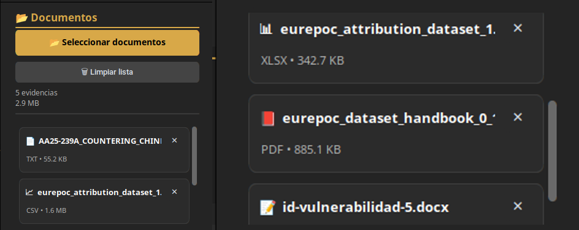
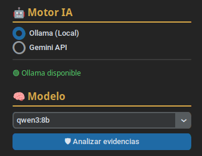

<p align="center">
  
</p>

<h1 align="center">Lince</h1>

<p align="center">
<b>AI-powered document intelligence platform for cybersecurity investigations</b><br>
Intelligent evidence analysis, IOC extraction and AI-assisted document processing.
</p>

<p align="center">

<a href="README.md">🇪🇸 Español</a> | <b>🇬🇧 English</b>

</p>

<p align="center">


</p>

---

# What is Lince?

**Lince** is an AI-powered document analysis platform designed to assist cybersecurity professionals during the processing of digital evidence and technical documentation.

The application combines traditional document processing techniques with Artificial Intelligence to accelerate evidence review, identify relevant indicators and support the production of structured technical reports.

Its architecture supports both **local AI models through Ollama** and **cloud-based analysis using the Google Gemini API**, allowing investigators to choose the most appropriate workflow for each case.

---

# Project Background

Lince was developed as one of the core applications within the **IberOSINT ecosystem**, with the objective of providing a dedicated platform for intelligent document analysis in cybersecurity investigations.

Although it integrates seamlessly with IberOSINT, Lince has been designed as an independent, modular application capable of evolving as a standalone project.

---

# Design Philosophy

The development of Lince is based on four fundamental principles:

- Reduce the time required for document analysis.
- Automate repetitive tasks while keeping the analyst in full control.
- Use Artificial Intelligence to assist, not replace, human expertise.
- Produce structured, transparent and reproducible analytical results.

---

# Use Cases

Lince has been designed to support a wide variety of cybersecurity investigation scenarios, including:

- Incident report analysis.
- Technical documentation review.
- Digital evidence processing.
- Indicator of Compromise (IOC) extraction.
- Summarization of lengthy documents.
- Technical report preparation.
- OSINT investigation support.

---

# Analysis Workflow

```

                    Evidence
                         │
                         ▼
              Document Processing
                         │
                         ▼
                 AI-Assisted Analysis
                         │
                         ▼
                  IOC Identification
                         │
                         ▼
                 Report Generation
                         │
                         ▼
                     Dashboard

```

Lince automates much of the document analysis process while ensuring that the analyst remains responsible for interpreting, validating and making decisions based on the generated results.

---

# Architecture

Lince follows a modular architecture that separates every stage of the document analysis workflow into independent components.

Each module has a well-defined responsibility, making the application easier to maintain, extend and integrate with future Artificial Intelligence providers.

```

                  +-----------------------+
                  |      User Interface   |
                  +-----------+-----------+
                              |
                              ▼
                  +-----------------------+
                  | Document Processing   |
                  +-----------+-----------+
                              |
                              ▼
                  +-----------------------+
                  | AI Provider Manager   |
                  +-----+-----------+-----+
                        |           |
             Google Gemini      Ollama
                        |           |
                        +-----+-----+
                              |
                              ▼
                  +-----------------------+
                  | Analysis Engine       |
                  +-----------+-----------+
                              |
                              ▼
                  +-----------------------+
                  | IOC Extraction        |
                  +-----------+-----------+
                              |
                              ▼
                  +-----------------------+
                  | Report Generator      |
                  +-----------------------+

```

This modular design allows each component to evolve independently without affecting the overall application.

---

# Document Processing

Lince supports several document formats commonly encountered during cybersecurity investigations.

Currently supported formats include:

- PDF
- DOCX
- XLSX
- CSV
- TXT

During the import process, the application automatically extracts the textual content required for AI-assisted analysis while preserving the original document.

<p align="center">

</p>

*Supported document processing workflow.*

---

# Artificial Intelligence

Lince has been designed around a provider-independent AI architecture.

Investigators can select the most appropriate AI engine depending on the sensitivity of the information, available resources and investigation requirements.

## Google Gemini

Lince integrates with the official Google Gemini API to perform cloud-based document analysis using advanced Large Language Models.

This mode is particularly suitable for:

- Large documents.
- Complex technical reports.
- Advanced reasoning tasks.
- High-quality analytical summaries.

---

## Ollama

Lince also supports fully local AI models through Ollama.

Running inference locally ensures that sensitive information never leaves the investigator's workstation, making this option especially valuable for confidential investigations.

Typical use cases include:

- Sensitive investigations.
- Offline environments.
- Privacy-focused workflows.

<p align="center">

</p>

*Selection of the Artificial Intelligence provider.*

---

# IOC Extraction

During document analysis, Lince assists investigators by identifying technical indicators that may be relevant to the investigation.

Examples include:

- IP addresses.
- Domain names.
- URLs.
- Email addresses.
- Cryptographic hashes.
- Additional technical indicators found within the analyzed documentation.

The objective is to accelerate the identification of relevant evidence while leaving the final interpretation and validation to the analyst.

<p align="center">

</p>

*IOC extraction dashboard.*

---

# Report Generation

Once the analysis is complete, Lince organizes the extracted information into a structured output that facilitates review and reporting.

Rather than generating conclusions automatically, the platform assists investigators by presenting organized findings that can be reviewed, validated and incorporated into technical reports.

This approach ensures that Artificial Intelligence remains a decision-support tool instead of replacing professional judgment.

---

# Key Features

- Modern Python-based graphical interface.
- Modular application architecture.
- Multi-format document processing.
- Google Gemini API integration.
- Local AI execution through Ollama.
- Automatic IOC extraction.
- AI-assisted document analysis.
- Extensible AI provider architecture.
- Designed specifically for cybersecurity investigations.
- Native integration with the IberOSINT ecosystem.

---

# Who is Lince for?

Lince has been designed for professionals and researchers who regularly work with technical documentation and digital evidence.

Typical users include:

- Security Analysts.
- Digital Forensics (DFIR) teams.
- Incident Response teams.
- Threat Intelligence analysts.
- SOC analysts.
- Malware researchers.
- Cybersecurity students.
- OSINT investigators.

---

# Screenshots

## Main Window


---

## AI Provider Selection


---

## Analysis Results


---

# Technologies

Lince combines modern development technologies with a modular architecture to deliver a reliable and extensible document analysis platform for cybersecurity investigations.

| Technology | Purpose |
|------------|---------|
| Python | Core application development |
| CustomTkinter | Desktop graphical user interface |
| Google Gemini API | Cloud-based AI document analysis |
| Ollama | Local AI model execution |
| PyMuPDF | PDF document processing |
| python-docx | Microsoft Word document processing |
| OpenPyXL | Excel spreadsheet processing |
| CSV | Tabular data processing |
| JSON | Configuration and application settings |

---

# Requirements

The recommended environment for running Lince is:

- Ubuntu 24.04 LTS or later.
- Python 3.11 or newer.
- Internet connection (for Google Gemini).
- Ollama installed (optional, for local AI models).
- Google Gemini API key (optional, depending on the selected AI provider).

---

# Installation

Clone the repository:

```bash
git clone https://github.com/JSantos1990/IberOSINT-Lince.git
```

Navigate to the project directory:

```bash
cd IberOSINT-Lince
```

Install the required dependencies:

```bash
pip install -r requirements.txt
```

Launch the application:

```bash
python app.py
```

---

# Configuration

Lince allows investigators to select the preferred Artificial Intelligence provider directly from the application interface.

Currently supported providers are:

## Google Gemini

Google Gemini uses the official Google API to perform cloud-based document analysis.

Recommended for:

- Large documents.
- Advanced reasoning tasks.
- Complex cybersecurity reports.
- High-quality analytical summaries.

---

## Ollama

Ollama enables fully local AI inference.

Recommended for:

- Confidential investigations.
- Offline environments.
- Privacy-focused workflows.
- Sensitive digital evidence.

---

# Project Status

Lince is actively maintained and continues to evolve.

Its modular architecture allows new document formats, AI providers and analytical capabilities to be incorporated without affecting the core application.

The long-term objective is to provide a flexible document intelligence platform capable of adapting to future cybersecurity investigation requirements.

---

# Roadmap

## Version 1.0

- [x] Desktop graphical interface
- [x] Multi-format document processing
- [x] Google Gemini integration
- [x] Ollama integration
- [x] Automatic IOC extraction
- [x] AI-assisted document analysis
- [x] Modular architecture

## Future Development

- [ ] Additional AI providers
- [ ] OCR support for images
- [ ] Batch document processing
- [ ] Advanced analytics dashboard
- [ ] Additional export formats
- [ ] Plugin architecture

---

# Screenshots

## Main Window


---

## AI Analysis


---

## Analysis Results


---

# License

Copyright © 2026 Jorge Santos

All Rights Reserved.

Lince was originally developed as part of the IberOSINT ecosystem and has evolved into an independent application focused on AI-assisted document intelligence for cybersecurity investigations.

The source code, documentation, images and all other resources contained within this repository are the intellectual property of the author.

No part of this repository may be copied, modified, redistributed or used, either in whole or in part, without the prior written permission of the author.

For additional information, please refer to the **LICENSE** file included in this repository.

---

# Author

## Jorge Santos

Developer of Lince.

Lince was created as part of the IberOSINT ecosystem to support cybersecurity professionals through intelligent document analysis, workflow automation and Artificial Intelligence.

GitHub

https://github.com/JSantos1990

---

# Acknowledgements

Special thanks to the Open Source community and to every developer whose work contributes to the advancement of Artificial Intelligence, cybersecurity research and digital investigations.

---

<p align="center">

<strong>Lince</strong><br>

AI-powered Document Intelligence Platform

<br><br>

© 2026 Jorge Santos · All Rights Reserved

</p>
