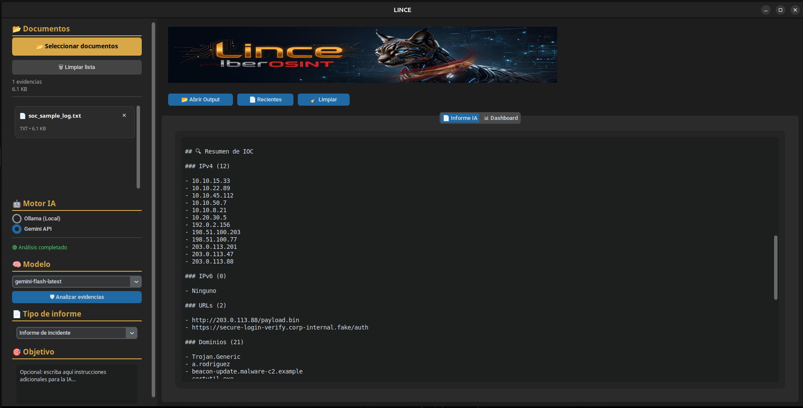

<p align="center">
  
</p>

<h1 align="center">Lince</h1>

<p align="center">
<b>Plataforma de análisis documental inteligente para investigaciones de ciberseguridad</b><br>
Análisis de evidencias asistido mediante Inteligencia Artificial, extracción de IOC y generación de informes.
</p>

<p align="center">

<a href="README.en.md">🇬🇧 English</a> | <b>🇪🇸 Español</b>

</p>

<p align="center">


</p>

---

# ¿Qué es Lince?

**Lince** es una plataforma de análisis documental desarrollada para asistir a investigadores y analistas de ciberseguridad durante el procesamiento de evidencias digitales.

La aplicación combina técnicas tradicionales de procesamiento documental con Inteligencia Artificial para facilitar el análisis de grandes volúmenes de información, identificar indicadores relevantes y acelerar la elaboración de informes técnicos.

Su arquitectura permite utilizar tanto modelos locales mediante **Ollama** como modelos en la nube a través de la **API de Google Gemini**, ofreciendo flexibilidad según las necesidades de cada investigación.

---

# Origen del proyecto

Lince nace como uno de los módulos principales del ecosistema **IberOSINT**, con el objetivo de proporcionar una herramienta especializada para el análisis inteligente de documentación relacionada con investigaciones de ciberseguridad.

Aunque forma parte del ecosistema IberOSINT, su arquitectura ha sido diseñada como una aplicación independiente, modular y fácilmente ampliable.

---

# Filosofía

El desarrollo de Lince se basa en cuatro principios fundamentales:

- Reducir el tiempo dedicado al análisis documental.
- Automatizar tareas repetitivas sin perder el control del proceso.
- Utilizar la Inteligencia Artificial como apoyo al analista.
- Generar resultados claros, estructurados y reproducibles.

---

# Casos de uso

Lince puede utilizarse en múltiples escenarios relacionados con la investigación digital, entre ellos:

- Análisis de informes de incidentes.
- Revisión de documentación técnica.
- Procesamiento de evidencias documentales.
- Extracción de indicadores de compromiso (IOC).
- Resumen de documentación extensa.
- Preparación de informes técnicos.
- Apoyo a investigaciones OSINT.

---

# Flujo general de trabajo

```

                    Evidence
                         │
                         ▼
              Document Processing
                         │
                         ▼
                 AI-Assisted Analysis
                         │
                         ▼
                 IOC Identification
                         │
                         ▼
                 Report Generation
                         │
                         ▼
                     Dashboard

```

Lince automatiza gran parte del procesamiento documental manteniendo siempre al analista como responsable de la interpretación y validación final de los resultados.

---

# Arquitectura

Lince ha sido desarrollado siguiendo una arquitectura modular que separa claramente las distintas fases del análisis documental.

Cada componente es responsable de una tarea concreta, facilitando el mantenimiento del código, la incorporación de nuevas funcionalidades y la integración de futuros proveedores de Inteligencia Artificial.

```

                  +-----------------------+
                  |      User Interface   |
                  +-----------+-----------+
                              |
                              ▼
                  +-----------------------+
                  | Document Processing   |
                  +-----------+-----------+
                              |
                              ▼
                  +-----------------------+
                  | AI Provider Manager   |
                  +-----+-----------+-----+
                        |           |
             Google Gemini      Ollama
                        |           |
                        +-----+-----+
                              |
                              ▼
                  +-----------------------+
                  | Analysis Engine       |
                  +-----------+-----------+
                              |
                              ▼
                  +-----------------------+
                  | IOC Extraction        |
                  +-----------+-----------+
                              |
                              ▼
                  +-----------------------+
                  | Report Generator      |
                  +-----------------------+

```

Esta arquitectura permite sustituir o ampliar cualquiera de los componentes sin afectar al resto de la aplicación.

---

# Procesamiento documental

Lince permite importar diferentes tipos de documentos utilizados habitualmente durante investigaciones de ciberseguridad.

Actualmente soporta los siguientes formatos:

- PDF
- DOCX
- XLSX
- CSV
- TXT

Durante la importación, la plataforma extrae automáticamente el contenido textual necesario para su posterior análisis mediante Inteligencia Artificial.

<p align="center">

</p>

*Procesamiento de documentos soportados por Lince.*

---

# Inteligencia Artificial

Lince ha sido diseñado para trabajar con diferentes proveedores de Inteligencia Artificial sin modificar el flujo de trabajo del usuario.

Actualmente incorpora soporte para:

## Google Gemini

Utiliza la API oficial de Google Gemini para realizar análisis avanzados mediante modelos de lenguaje alojados en la nube.

Resulta especialmente útil para el procesamiento de documentos extensos y tareas complejas de interpretación.

## Ollama

Permite ejecutar modelos de lenguaje completamente en local, garantizando que la información permanezca en el equipo del investigador.

Esta opción resulta especialmente adecuada cuando la privacidad de la información constituye un requisito fundamental.

<p align="center">

</p>

*Selección del proveedor de Inteligencia Artificial.*

---

# Extracción de IOC

Durante el análisis documental, Lince facilita la identificación de información relevante que puede resultar útil durante una investigación.

Entre los elementos que pueden localizarse se encuentran:

- Direcciones IP.
- Dominios.
- URLs.
- Direcciones de correo electrónico.
- Hashes.
- Indicadores técnicos presentes en la documentación.

El objetivo es facilitar al analista la localización rápida de evidencias sin sustituir el proceso de validación humana.

<p align="center">

</p>

*Panel de indicadores obtenidos durante el análisis formato resumen.*

<p align="center">

</p>

*Panel de indicadores obtenidos durante el análisis formato dashboard.*

---

# Generación de informes

Una vez finalizado el análisis, Lince organiza automáticamente la información obtenida para facilitar su revisión.

Los resultados se presentan de forma estructurada, permitiendo al investigador revisar las conclusiones generadas por la Inteligencia Artificial antes de incorporarlas a un informe definitivo.

La filosofía del proyecto consiste en asistir al analista, nunca en reemplazar su criterio profesional.

---

# Características principales

- Interfaz gráfica desarrollada en Python.
- Arquitectura modular.
- Procesamiento de múltiples formatos documentales.
- Integración con Google Gemini mediante API.
- Integración con Ollama para modelos locales.
- Extracción automática de indicadores de compromiso (IOC).
- Análisis documental asistido mediante IA.
- Preparado para incorporar nuevos proveedores de IA.
- Diseñado para investigaciones de ciberseguridad.
- Integración con el ecosistema IberOSINT.

---

# Capturas

## Cabecera


---

## Selección del proveedor de IA


---

## Resultados del análisis


---

# Tecnologías

Lince combina diferentes tecnologías para ofrecer una plataforma moderna, modular y preparada para evolucionar con nuevas capacidades de análisis.

| Tecnología | Función |
|------------|---------|
| Python | Desarrollo de la aplicación |
| CustomTkinter | Interfaz gráfica |
| Google Gemini API | Análisis mediante IA en la nube |
| Ollama | Ejecución local de modelos de IA |
| PyMuPDF | Procesamiento de documentos PDF |
| python-docx | Procesamiento de documentos Word |
| OpenPyXL | Lectura de hojas de cálculo Excel |
| CSV | Procesamiento de datos tabulares |
| JSON | Configuración y almacenamiento |

---

# Requisitos

Para ejecutar Lince se recomienda el siguiente entorno:

- Ubuntu 24.04 LTS o superior.
- Python 3.11 o superior.
- Conexión a Internet para utilizar Google Gemini.
- Ollama instalado para utilizar modelos locales (opcional).
- Clave API de Google Gemini (opcional según el proveedor seleccionado).

---

# Instalación

Clonar el repositorio:

```bash
git clone https://github.com/JSantos1990/IberOSINT-Lince.git
```

Acceder al directorio:

```bash
cd IberOSINT-Lince
```

Instalar las dependencias:

```bash
pip install -r requirements.txt
```

Ejecutar la aplicación:

```bash
python app.py
```

---

# Configuración

Lince permite seleccionar el proveedor de Inteligencia Artificial desde la propia interfaz de la aplicación.

Actualmente existen dos modos de funcionamiento:

## Google Gemini

Requiere configurar una API Key válida de Google Gemini.

Ideal para:

- Documentos extensos.
- Análisis complejos.
- Mayor capacidad de razonamiento.

---

## Ollama

Permite ejecutar modelos de lenguaje completamente en local.

Ideal para:

- Información sensible.
- Entornos desconectados.
- Mayor privacidad.

---

# Estado del proyecto

Lince continúa en desarrollo activo.

La arquitectura modular facilita la incorporación de nuevos motores de IA, nuevos formatos documentales y funcionalidades adicionales sin modificar la estructura principal de la aplicación.

---

## Próximas mejoras

- [ ] Nuevos proveedores de IA
- [ ] OCR para imágenes
- [ ] Procesamiento por lotes
- [ ] Dashboard estadístico avanzado
- [ ] Exportación en nuevos formatos
- [ ] Sistema de plugins

---

# Licencia

Copyright © 2026 Jorge Santos

Todos los derechos reservados.

Lince fue desarrollado originalmente como parte del ecosistema IberOSINT y constituye una plataforma independiente especializada en análisis documental asistido mediante Inteligencia Artificial.

El código fuente, la documentación y todos los recursos incluidos en este repositorio son propiedad intelectual del autor.

No está permitida la copia, redistribución, modificación o utilización parcial o total del proyecto sin autorización expresa y por escrito del autor.

Para más información consulte el archivo **LICENSE** incluido en este repositorio.

---

# Autor

## Jorge Santos

Desarrollador de Lince.

Proyecto desarrollado como parte del ecosistema IberOSINT para facilitar el análisis documental inteligente durante investigaciones de ciberseguridad.

GitHub:

https://github.com/JSantos1990

---

# Agradecimientos

Mi agradecimiento a la comunidad Open Source y a todos los proyectos que contribuyen al avance de la Inteligencia Artificial aplicada a la ciberseguridad y al análisis documental.

---

<p align="center">

<strong>Lince</strong><br>

AI-powered Document Analysis Platform

<br><br>

© 2026 Jorge Santos · All Rights Reserved

</p>
